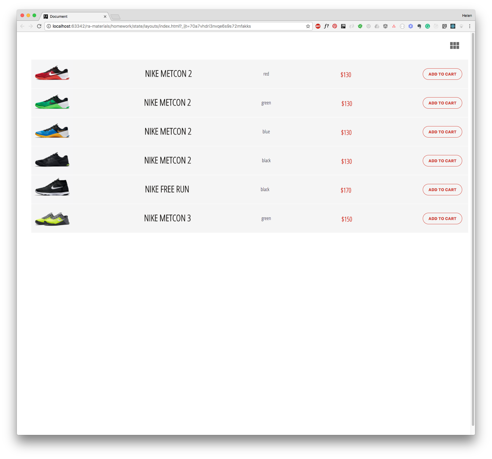

Расположение товаров
===

Разработан компонент Store, отображающий товары в интернет-магазине. 
Пользователь может увидеть товары в виде карточек или в виде списка, в зависимости от того, какое расположение он выберет.

Компонент Store управляет состоянием приложения и хранит список товаров в атрибуте products.

Иконка разметки, которая указывает на переключение между типами расположения товаров, реализована в компоненте без состояния IconSwitch, которому от Store передаются два свойства:

- `icon` — название иконки, которую нужно показать
- `onSwitch()` — обработчик события, который реагирует на нажатие пользователем на иконку

Компоненту CardsView от Store передается свойство cards — массив с данными, каждый элемент из которого затем уже отображается с помощью карточки товара ShopCard.

Компоненту ListView от Store также передается всего одно свойство items — массив с данными, каждый элемент из которого затем уже отображается с помощью ShopItem для товаров, которые нужно отобразить.

Для стилизации кнопки смены вила отображения карточек использовались иконки из библиотеки [material icons](https://fonts.google.com/icons)

## Установка и запуск приложения на локальной машине:
1. `git clone https://github.com/IrinaSakhno/events-and-status.git` - клонировать репозиторий на свое устройство
2. `cd shop` - перейти в папку shop
3. `npm i` - установить зависимости
4. `npm run start` - запустить приложение в режиме разработчика

После этого приложение можно будет открыть по ссылке  [http://localhost:3000](http://localhost:3000) в Вашем браузере.